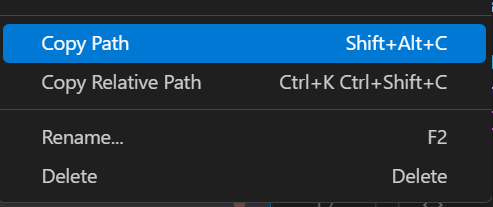

# Introduction

Let's discover **How to make more faster creating an unit test**.

## Getting Started

Get started by **clone repo from github**.

clone from last change **[Github](https://github.com/ZiddanDwiPutra/testarossa)**.

OR you can take released version on here **[Github/Release](https://github.com/ZiddanDwiPutra/testarossa/releases/tag/release-0.1)**

### What you'll need

- [Node.js](https://nodejs.org/en/download/) version 16.14 or above:
  - When installing Node.js, you are recommended to check all checkboxes related to dependencies.

## Dont forget to NPM install

before we are try to first run generating the Unit test, first of all we need to install all depedencies of package

```bash
npm install
```
You can type this command into Command Prompt, Powershell, Terminal, or any other integrated terminal of your code editor.

## First Run Generate

You need to scope the folder of your project, it can generate all your *.tsx file* to created an unit test per each file.

Copy path from your target destination folder to generate



and paste it then run command.

```bash
node testarossa -d {copied-path}
```